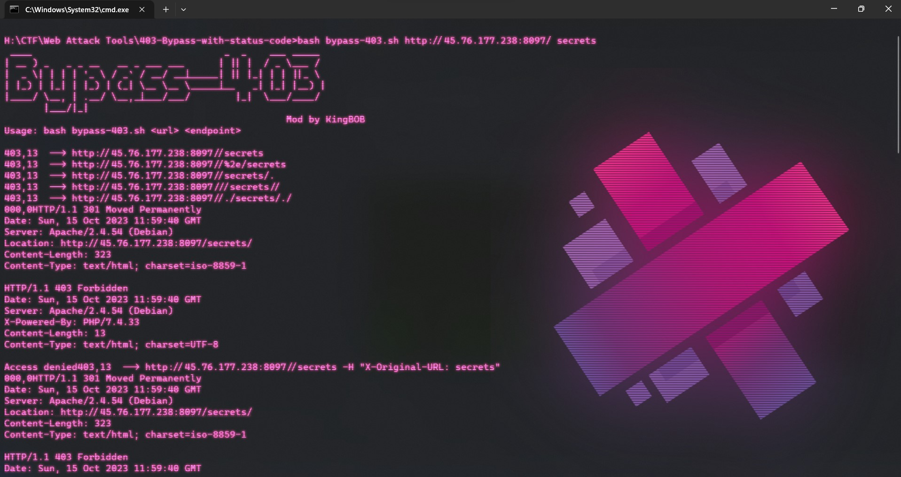
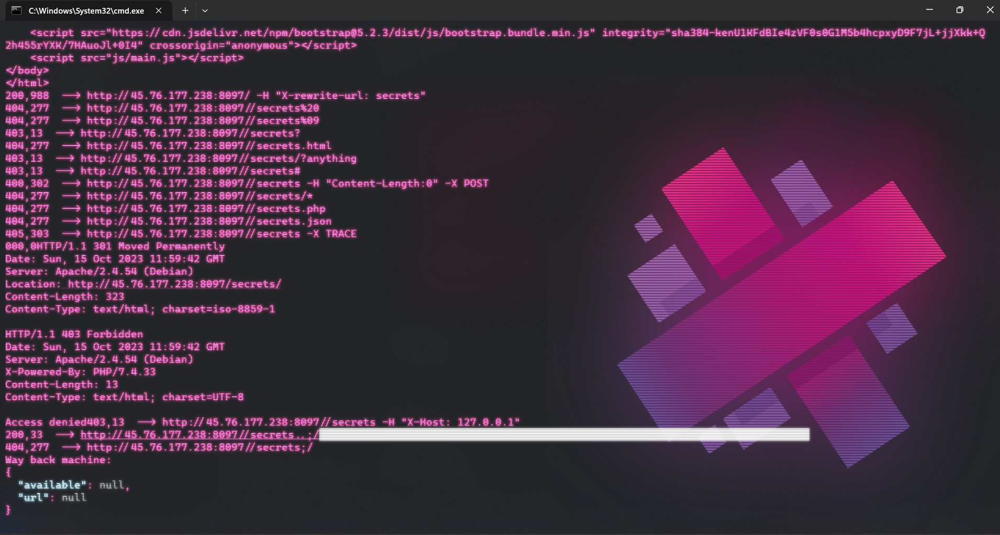

# Bypass-403 With status code 

First of all I would like to thanks `https://github.com/iamj0ker/bypass-403`

- A simple script just made for self use for bypassing 403
- It can also be used to compare responses on verious conditions as shown in the below snap
  
- 

# Usage

`bash bypass-403.sh https://example.com admin`

`bash bypass-403.sh website-here path-here`

# Features

- Use 24 known Bypasses for 403 with the help of curl

# Installation

* `https://github.com/mrx-arafat/Web-403-Bypass-dos2unix`
* `cd bypass-403`
* `chmod +x bypass-403.sh`
* `sudo apt install figlet`  - If you are unable to see the logo as in the screenshot
* `sudo apt install jq`      - If you don't have jq installed on your machine
* `sudo apt-get install dos2unix`
* `dos2unix bypass-403.sh`
